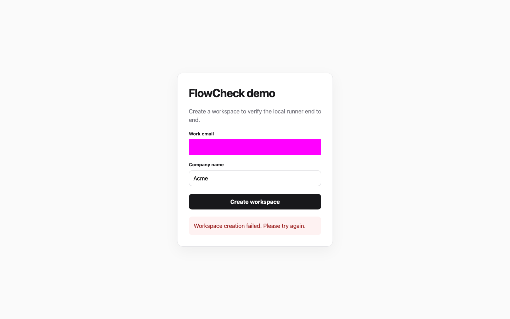
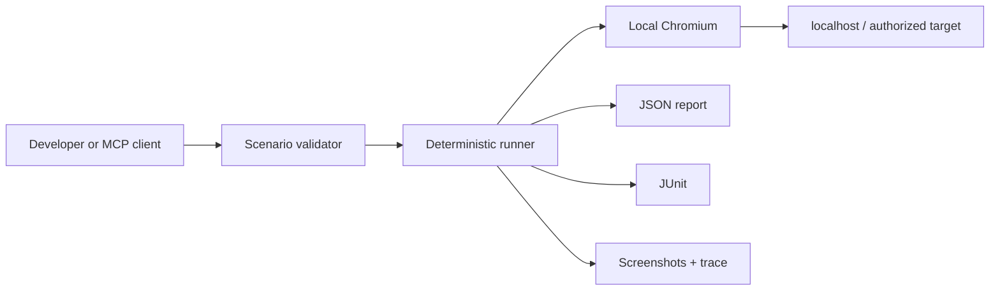

<p align="center">
  
</p>

<h1 align="center">FlowCheck Local</h1>

<p align="center">
  Turn AI-written browser checks into repeatable tests with evidence.
</p>

<p align="center">
  <a href="https://github.com/kadessovb02/flowcheck/actions/workflows/ci.yml"></a>
  <a href="LICENSE"></a>
  
  
</p>

<p align="center">
  <a href="#five-minute-quickstart">Quickstart</a> ·
  <a href="docs/scenario-format.md">Scenario DSL</a> ·
  <a href="#connect-an-ai-agent-with-mcp">MCP</a> ·
  <a href="README.ru.md">Русский</a>
</p>

---

**Your coding agent changed the UI. Does the user journey still work?**

FlowCheck Local replays a JSON scenario in Chromium and saves a pass/fail report, screenshots, a Playwright trace, and JUnit XML. Review the steps once, commit them, and rerun the same checks from the CLI or an MCP client after the next change.

**Runs on localhost. No FlowCheck account, API key, or model call required by the runner.**

```text
You or your agent → reviewable JSON scenario → Chromium → pass/fail + evidence
```

Use it for small smoke checks such as signup, form submission, and navigation. The runner executes the steps you supply; an AI agent can help write them before a run.

[Try the demo](#five-minute-quickstart) · [See it catch a failure](#see-it-catch-a-failure) · [Choose the right tool](#how-it-fits-with-playwright)

## Why FlowCheck Local

- **Deterministic replay.** The same versioned scenario runs without an AI making new decisions halfway through.
- **Localhost works.** Chromium runs next to the application under development.
- **Evidence is built in.** Every run can produce screenshots, trace, JSON, and JUnit.
- **Accessible locators first.** Role, label, placeholder, test id, and visible text are first-class selectors.
- **Secrets stay out of scenarios.** Read values from environment variables and mask sensitive fields in screenshots.
- **MCP ready.** Codex, Claude Code, and other MCP clients can validate and run scenarios from the repository.
- **No telemetry.** The open-source runner does not phone home.

## Five-minute quickstart

Requirements: Node.js 22.18+ on macOS or Linux.

```bash
git clone https://github.com/kadessovb02/flowcheck.git
cd flowcheck
npm ci
npx playwright install chromium
npm run quickstart
```

The quickstart starts the included demo on port **4173**, creates an Acme workspace in Chromium, checks its confirmation and URL, then stops the demo server. No separate application setup is needed.

To watch the browser, run `npm run quickstart -- --headed`. On Linux, if Chromium reports missing system libraries, install them with `npx playwright install --with-deps chromium`.

Example output (timings and absolute evidence path omitted):

```text
FlowCheck · Create a demo workspace
Target: http://127.0.0.1:4173
Steps:  6

✓ open-home · goto
✓ enter-email · fill
✓ enter-company · fill
✓ create-workspace · click
✓ confirmation · assertText
✓ welcome-url · assertUrl

PASSED
Evidence: .flowcheck/runs/...
```

## See it catch a failure

```bash
npm run quickstart -- --broken
```

This starts a deliberately broken version of the demo: submitting the form shows an error. **The scenario stays unchanged.** FlowCheck fails at `confirmation`, skips the remaining URL assertion, saves the failure screenshot and trace, and exits with code **1**. This failure is expected.

```text
✓ open-home · goto
✓ enter-email · fill
✓ enter-company · fill
✓ create-workspace · click
✗ confirmation · assertText

FAILED
Evidence: .../.flowcheck/runs/<run-id>
```

<p align="center">
  
</p>

The image is an actual screenshot from the bundled public demo. Reproduce it with the command above; run without `--broken` to see the same scenario pass.

## How it fits with Playwright

FlowCheck uses Playwright underneath. Choose based on the workflow you need:

| Tool | A good fit when you want… |
|---|---|
| [Playwright Test](https://playwright.dev/docs/intro) | A full test suite written in code, with fixtures, multiple browsers, and parallel execution. |
| [Playwright MCP](https://github.com/microsoft/playwright-mcp) | An agent that explores a browser interactively and chooses its next action. |
| **FlowCheck Local** | A small, reviewed JSON journey replayed as one run through CLI or MCP, with local evidence and no model decisions during execution. |

Already happy with a Playwright test suite? Keep it. FlowCheck is useful when a constrained JSON format makes checks easier to review and hand between a person, an agent, and automation. It currently supports Chromium only, sequential steps, and the actions in the [scenario reference](docs/scenario-format.md).

## Run your own scenario

Create a starter file:

```bash
npm run flowcheck -- init flowcheck.scenario.json
```

Edit the URL and steps, then run it:

```bash
npm run flowcheck -- validate flowcheck.scenario.json
npm run flowcheck -- run flowcheck.scenario.json --headed
```

For a working example, start the bundled app with `npm run demo` in a second terminal, save this as `flowcheck.scenario.json`, and run the commands above:

```json
{
  "version": 1,
  "name": "Create a workspace",
  "baseUrl": "http://127.0.0.1:4173",
  "evidence": { "screenshots": "on-failure", "trace": true },
  "steps": [
    { "id": "open", "action": "goto", "path": "/" },
    { "id": "email", "action": "fill", "target": { "label": "Work email" }, "value": "developer@example.com" },
    { "id": "company", "action": "fill", "target": { "label": "Company name" }, "value": "Acme" },
    { "id": "create", "action": "click", "target": { "role": "button", "name": "Create workspace" } },
    { "id": "confirm", "action": "assertText", "text": "Workspace Acme is ready", "exact": true }
  ]
}
```

For your own application, start its dev server, change `baseUrl`, and replace the locators and assertions. Use [`valueFromEnv` and screenshot masks](docs/scenario-format.md#secrets) for sensitive inputs.

See the complete [Scenario DSL reference](docs/scenario-format.md).

## Connect an AI agent with MCP

Build the local MCP server:

```bash
npm run build
```

Codex configuration:

```toml
[mcp_servers.flowcheck]
command = "node"
args = ["/absolute/path/to/flowcheck/dist/src/mcp.js"]
env = { FLOWCHECK_WORKSPACE_ROOT = "/absolute/path/to/your/project" }
```

Claude Code `.mcp.json`:

```json
{
  "mcpServers": {
    "flowcheck": {
      "command": "node",
      "args": ["/absolute/path/to/flowcheck/dist/src/mcp.js"],
      "env": { "FLOWCHECK_WORKSPACE_ROOT": "/absolute/path/to/your/project" }
    }
  }
}
```

The server exposes three tools:

| Tool | Effect |
|---|---|
| `flowcheck_validate_scenario` | Validates a scenario without opening a browser |
| `flowcheck_run_scenario` | Runs Chromium and writes evidence |
| `flowcheck_latest_report` | Returns the latest concise result in the session |

The MCP server only accepts scenario files inside `FLOWCHECK_WORKSPACE_ROOT`. Running a scenario is an explicit side effect; validation is read-only.

## What a run produces

```text
.flowcheck/runs/<run-id>/
├── report.json      # versioned machine-readable result
├── junit.xml        # CI-compatible result
├── trace.zip        # open with Playwright Trace Viewer
└── *-failed.png     # failure evidence, masked when configured
```

Open a trace:

```bash
npx playwright show-trace .flowcheck/runs/<run-id>/trace.zip
```

The CLI returns `0` for a pass, `1` for a failed check, and `2` for invalid input or a setup error. Automation can use these exit codes and collect `junit.xml` and `report.json` from the evidence directory. See the [demo CI workflow](.github/workflows/ci.yml) for a runnable example.

## Architecture



The runner intentionally does **not** generate test plans, change assertions, execute arbitrary JavaScript, or modify application source code. Those are separate trust boundaries. See [Architecture](docs/architecture.md).

## Security

- Run FlowCheck only against systems you own or are authorized to test.
- Navigation is restricted to the scenario's origin.
- Credentials can be read from environment variables instead of JSON.
- Sensitive literal fill inputs are redacted in report step data.
- Screenshot masking is explicit and locator based. It does **not** redact Playwright traces, page URLs, or error messages; treat evidence as potentially sensitive.
- Scenario files cannot execute arbitrary JavaScript or shell commands.
- Telemetry is disabled because none is implemented.

Please report vulnerabilities privately according to [SECURITY.md](SECURITY.md). Do not include credentials, customer data, screenshots, or live target URLs in a public issue.

## Project status

FlowCheck Local is an **early developer preview**. Install from source using the quickstart; npm installation is not provided yet. The DSL and report schema are versioned, but may change before a stable release. Current support is Chromium on macOS and Linux.

The open-source runner works independently. Hosted planning, scheduling, and team workflows are outside this repository; see the [architecture and project boundary](docs/architecture.md).

## Contributing

Try FlowCheck on one real user journey and [tell us what failed or felt difficult](https://github.com/kadessovb02/flowcheck/issues/new/choose). A small public reproduction is especially helpful.

Want to contribute code or docs? Start with [CONTRIBUTING.md](CONTRIBUTING.md). Useful contributions include framework examples, clearer setup errors, evidence redaction, and cross-platform packaging.

If repeatable browser checks for coding agents would help your workflow, **star the repository** to help others discover it.

## License

Apache License 2.0. See [LICENSE](LICENSE). The license covers this repository, not the hosted FlowCheck service or the FlowCheck trademarks.
