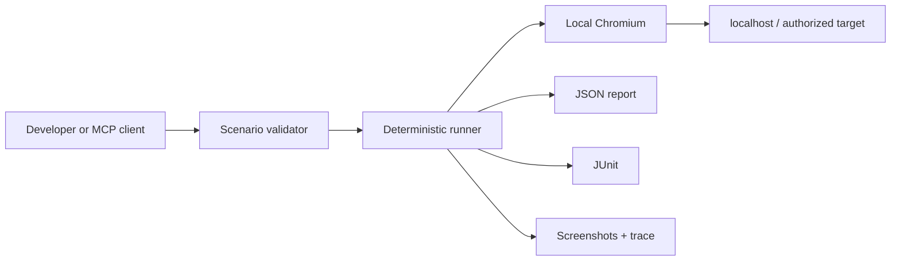

<p align="center">
  
</p>

<h1 align="center">FlowCheck Local</h1>

<p align="center">
  Deterministic browser checks for localhost — with Playwright evidence and MCP.
</p>

<p align="center">
  <a href="https://github.com/kadessovb02/flowcheck/actions/workflows/ci.yml"></a>
  <a href="LICENSE"></a>
  
  
</p>

<p align="center">
  <a href="#five-minute-quickstart">Quickstart</a> ·
  <a href="docs/scenario-format.md">Scenario DSL</a> ·
  <a href="#connect-an-ai-agent-with-mcp">MCP</a> ·
  <a href="README.ru.md">Русский</a>
</p>

---

FlowCheck Local runs approved user journeys in a real Chromium browser on the developer's machine. It produces screenshots, a Playwright trace, a machine-readable report, and JUnit XML — without sending the tested page or credentials to FlowCheck.

This repository is the open execution layer of FlowCheck. The hosted product adds AI planning, team workflows, product coverage, schedules, and verified defect-to-MR orchestration.

## Why FlowCheck Local

- **Deterministic replay.** The same versioned scenario runs without an AI making new decisions halfway through.
- **Localhost works.** Chromium runs next to the application under development.
- **Evidence is built in.** Every run can produce screenshots, trace, JSON, and JUnit.
- **Accessible locators first.** Role, label, placeholder, test id, and visible text are first-class selectors.
- **Secrets stay out of scenarios.** Read values from environment variables and mask sensitive fields in screenshots.
- **MCP ready.** Codex, Claude Code, and other MCP clients can validate and run scenarios from the repository.
- **No telemetry.** The open-source runner does not phone home.

## Five-minute quickstart

Requirements: Node.js 22.18+ on macOS or Linux.

```bash
git clone https://github.com/kadessovb02/flowcheck.git
cd flowcheck
npm install
npx playwright install chromium
npm run quickstart
```

The quickstart starts a small local product, completes a form in Chromium, checks the result, and writes evidence to `.flowcheck/runs/`.

Expected output:

```text
FlowCheck · Create a demo workspace
Target: http://127.0.0.1:4173
Steps:  6

✓ open-home · goto
✓ enter-email · fill
✓ enter-company · fill
✓ create-workspace · click
✓ confirmation · assertText
✓ welcome-url · assertUrl

PASSED
Evidence: .flowcheck/runs/...
```

## Run your own scenario

Create a starter file:

```bash
npm run flowcheck -- init flowcheck.scenario.json
```

Edit the URL and steps, then run it:

```bash
npm run flowcheck -- validate flowcheck.scenario.json
npm run flowcheck -- run flowcheck.scenario.json --headed
```

Example:

```json
{
  "version": 1,
  "name": "Create a customer",
  "baseUrl": "http://127.0.0.1:3000",
  "evidence": {
    "screenshots": "on-failure",
    "trace": true,
    "mask": [{ "label": "Password" }]
  },
  "steps": [
    { "id": "open", "action": "goto", "path": "/login" },
    {
      "id": "password",
      "action": "fill",
      "target": { "label": "Password" },
      "valueFromEnv": "DEMO_PASSWORD",
      "sensitive": true
    },
    { "id": "sign-in", "action": "click", "target": { "role": "button", "name": "Sign in" } },
    { "id": "dashboard", "action": "assertText", "text": "Dashboard" }
  ]
}
```

See the complete [Scenario DSL reference](docs/scenario-format.md).

## Connect an AI agent with MCP

Build the local MCP server:

```bash
npm run build
```

Codex configuration:

```toml
[mcp_servers.flowcheck]
command = "node"
args = ["/absolute/path/to/flowcheck/dist/src/mcp.js"]
env = { FLOWCHECK_WORKSPACE_ROOT = "/absolute/path/to/your/project" }
```

Claude Code `.mcp.json`:

```json
{
  "mcpServers": {
    "flowcheck": {
      "command": "node",
      "args": ["/absolute/path/to/flowcheck/dist/src/mcp.js"],
      "env": { "FLOWCHECK_WORKSPACE_ROOT": "/absolute/path/to/your/project" }
    }
  }
}
```

The server exposes three tools:

| Tool | Effect |
|---|---|
| `flowcheck_validate_scenario` | Validates a scenario without opening a browser |
| `flowcheck_run_scenario` | Runs Chromium and writes evidence |
| `flowcheck_latest_report` | Returns the latest concise result in the session |

The MCP server only accepts scenario files inside `FLOWCHECK_WORKSPACE_ROOT`. Running a scenario is an explicit side effect; validation is read-only.

## What a run produces

```text
.flowcheck/runs/<run-id>/
├── report.json      # stable machine-readable result
├── junit.xml        # CI-compatible result
├── trace.zip        # open with Playwright Trace Viewer
└── *-failed.png     # failure evidence, masked when configured
```

Open a trace:

```bash
npx playwright show-trace .flowcheck/runs/<run-id>/trace.zip
```

## Architecture



The runner intentionally does **not** generate test plans, change assertions, execute arbitrary JavaScript, or modify application source code. Those are separate trust boundaries. See [Architecture](docs/architecture.md).

## Security

- Run FlowCheck only against systems you own or are authorized to test.
- Navigation is restricted to the scenario's origin.
- Credentials can be read from environment variables instead of JSON.
- Sensitive fill values are redacted from reports.
- Screenshot masking is explicit and locator based.
- Scenario files cannot execute arbitrary JavaScript or shell commands.
- Telemetry is disabled because none is implemented.

Please report vulnerabilities privately according to [SECURITY.md](SECURITY.md). Do not include credentials, customer data, screenshots, or live target URLs in a public issue.

## Project status

FlowCheck Local is an early developer preview. The DSL and report schema are versioned, but backward compatibility is guaranteed only within a documented stable release. Current support is Chromium on macOS and Linux.

## Contributing

Start with [CONTRIBUTING.md](CONTRIBUTING.md). Useful first contributions include new deterministic actions, cross-platform packaging, evidence redaction, and compatibility fixtures for real UI frameworks.

## License

Apache License 2.0. See [LICENSE](LICENSE). The license covers this repository, not the hosted FlowCheck service or the FlowCheck trademarks.
